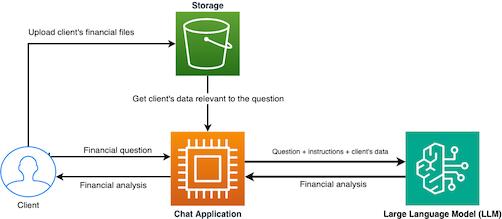

# Introduction to Terraform

Jakub Konczyk
kuba@kubakonczyk.com

---
# Get the Materials

[github.com/jakamkon/ps-tt](https://github.com/jakamkon/ps-tt)

---
# Session Objectives

By the end of this session, you'll be able to:
- Identify common Terraform use cases using an enterprise cloud-based app as an example
- Define infrastructure, resources, and resource management
- Recognize the pitfalls of web-based resource management **(Demo 1)**
- Recognize the pitfalls of command-line-based resource management **(Demo 2)**
- Explain how Terraform solves those problems
- Apply the core Terraform workflow to manage resources **(Demo 3)**

---
# Use Case: Cloud-based LLM App for Financial Analysis

Imagine you are part of a team building **a cloud-based chat application** that answers analytical questions about **clients' financial documents**.

Your task: determine the most efficient way to **provision and manage infrastructure** as the application scales.

---
# Application Architecture Overview

